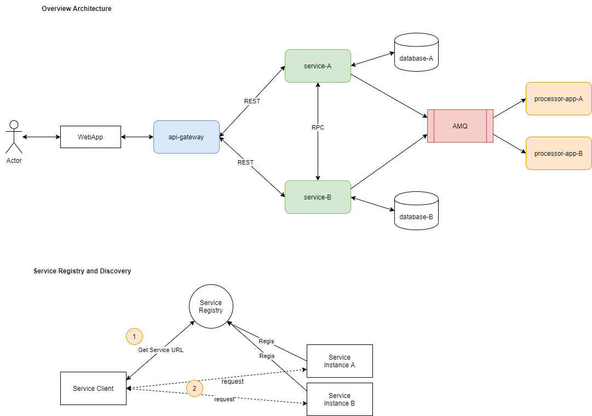

# I-Commerce System
Author: Duong Thanh Truc

# Introduction
This is a micro-service system that build for online shopping application to sell products.

## Architecture

## Deployment
TBD.

# Technologies
* Java 8
* Spring Boot / Spring Could
* JPA/Spring Data
* AMQP/RabbitMQ
* GRPC/Proto
* JUnit, Mockito
* H2 Database (for demo propose)

# Developmnet
## Environment Setup
TBD.

## Components / Services
### common
* **common-repository** Common library to access database
* **common-webservice** Common library for webservice
* **common-processor** Common library for processor application

### Platform / Infrastructure
* **registration-and-discovery** Eureka service registry that enables client-side load-balancing and decouples service providers from consumers without the need for DNS.
* activemp

### User Application
* **icommerce-webapp** Server Web Application (Spring MVC)

### Gateway
* **api-gateway** API gateway service

### product-service
* **product-client** Client library to communicate with product service
* **product-repository** Library to access database
* **product-service** Shared library arross product service (webservice, processor, grpc-service,...)
* **product-webservice** Webservice APIs
* **product-processor** Processor service to process event from AMQP

### shopping-service
* **shopping-client** Client library to communicate with shopping service
* **shopping-repository** Library to access database
* **shopping-webservice** Webservice APIs
* **shopping-porcessor** Processor service to process event from AMQP

### audit-service
* **audit-client** Client library to communicate with audit service
* **audit-repository** Library to access database
* **audit-processor** Webservice APIs
* **audit-webservice** Processor service to process event from AMQP

# API Specification
TBD.

# References
* https://docs.spring.io/spring-boot/docs/current/reference/html/index.html
* https://microservices.io/articles/applying.html
* https://spring.io/blog/2015/01/20/microservice-registration-and-discovery-with-spring-cloud-and-netflix-s-eureka